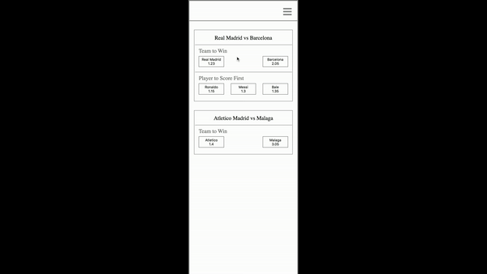

# sports-betting
 
[Addison Global Frontend Technical Assessment] (https://github.com/addisonglobal/frontend-technical-test)

## Prerequisites

* [Git](http://git-scm.com/)
* [npm](https://www.npmjs.org/)

## Steps to run the app

* Download or clone repo
* Go to downloaded location via command line
* `npm install` to install all dependencies
* `npm start` app should open in your default browser

## App functionality

* Data for various market is being fetched when page loads.
* Sports event with 0 market (betting opportunity) does not display on screen.
* User bets of various outcome by making a selection.
* When selection event is clicked, it turns green.
* Clicking on menu icon opens overlay.
* Overlay shows all the selections that user made.
* Clicking on close button on overlay closes overlay.
* Clicking on remove button to cancels the selection.

## Demo

